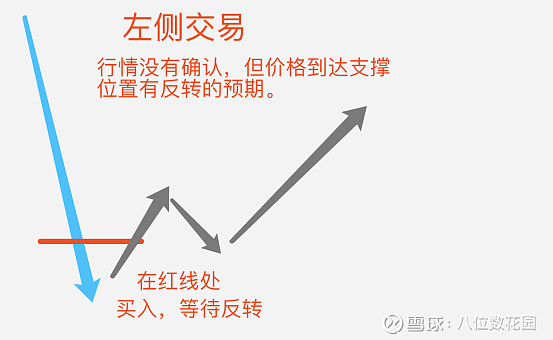

# 扛单心理分析

为什么你总是一涨就卖飞，一跌就扛单？

这就是交易心理学中的“处置效应”。

人们盈利时更倾向于落袋为安，而亏损时却会不断加仓，根源在于人类天性中对损失的厌恶。

曾经有人做过一个实验，损失100美元的痛苦远大于得到150美元的快乐，这让我们更容易受到情绪的影响而做出错误的决策。

另一点在于，如果我们认为某个资产会涨，但事实却与之相反，这就会引发认知失调。为了缓解这种认知上的矛盾，我们可能会选择继续持有亏损的仓位。

处置效应除了会让你错过利润、硬扛亏损外，也让人无法专心去研究其他交易机会，这点我现在深有体会。

我们可能会在亏损的单子上继续加仓，期望早日回本。但这样也积累了巨大的单点风险，同时给情绪带来极大的压力。

想要解决这个问题，我觉得要做到两点：

1. 给自己制定明确的规则，例如回撤多少就卖出
2. 不要过于自信预判走势，一旦走势不对要及时认错

阿尔布鲁克斯研究过上万张图表，行情一旦形成趋势，80% 的情况下都不会反转，知道这一点会让我们更快地认清现实。

除此之外，另一个心理是“禀赋效应”，由 2017 年诺贝尔经济学奖得主理查德·塞勒提出。

在交易中，人们往往过于高估自己持有的资产价值而不愿意在下跌时卖出。

经济学家李斯特曾经进行过关于禀赋效应的实验。实验中，工作人员把参加者随机分成两组：

（i）一组在完成问卷后，得到一只咖啡杯作为“礼物”。

（ii）而另一组完成问卷后，得到一盒巧克力作为“礼物”。两者为同等价值。

当他们收到“礼物”后，工作人员便告诉两组参加者其实可以选择巧克力或咖啡杯作为“礼物”，询问他们会否互相交换。而因为参加者为随机分配，所以统计学上应该有大概一半的参加者选择互相交换。

而结果是：只有一成的参加者选择互相交换，换句话说，

（i）得到咖啡杯的人中有大部分人认为咖啡杯较好；

（ii）而得到巧克力的人中有大部分人认为巧克力较好。

从而心理学家推断出：人类倾向于喜欢自己拥有的东西，当我们产生拥有一件东西的感觉后，该东西的价值也会在我们心中相应地提升。

<figure><figcaption></figcaption></figure>


以色列和美国经济学家、心理学家、诺贝尔经济学奖获得者丹尼尔·卡内曼（Daniel Kahneman）设计了一个投掷硬币的实验。

实验用硬币是均质的。约定如果扔出正面，将得到150美元；如果是背面，将输掉100美元。这个赌局对于参与者来说，长期下注的话，肯定是稳赚不赔的，毕竟输赢概率相同，赢的收益大于输的损失。

但是实验结果却是，大多数人仍然拒绝了这个赌局，因为对于多数人来说，损失 100 美元的痛苦远远大于得到 150 美元的快乐。最少收益多少，快乐才能弥补普通人是失去 100 美元的痛苦呢？答案是，200 美元。

实验的结果表明，损失带来的负效用为收益的正效用的2至2.5倍。

损失厌恶效应（Loss aversion effect），也称损失厌恶（Loss aversion）、损失厌恶心理，是指人们面对同样数量的收益和损失时，认为损失更加令他们难以忍受。同量的损失带来的负效用为同量收益的正效用的2至2.5倍。

这一心理规律，反映了人们的风险偏好并不是一致的，当涉及的是收益时，人们表现为风险厌恶；当涉及的是损失时，人们则表现为风险寻求。

损失厌恶是凯尼曼和特沃斯基前景理论/期望效用理论（Keniman and Tvorsky's Prospect Theory）的理论基石之一，被行为经济学家应用到消费决策、生产/供给、投资等多个领域。

.png>)


