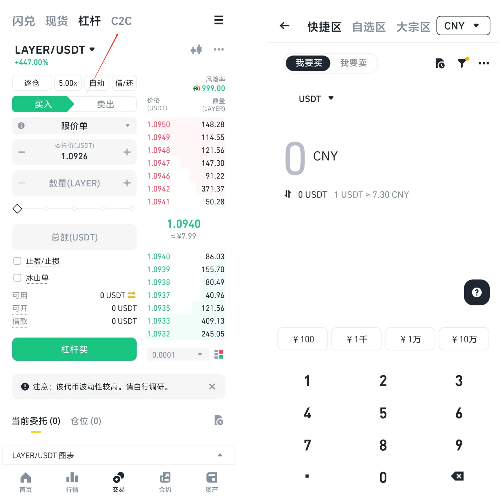

# 币安注册教程

## 币安注册教程

币安是全球第一大交易所，服务器稳定安全、交易量大、费率低、币种多、是炒币新手必选的交易平台。

注册流程也非常简单，接下来我将会教大家怎么一步步注册币安账户，仅需几分钟便可完成注册。

美国和新加坡 IP 无法注册币安账户，因此需避免使用这些地区的 IP。

虽然币安也有[国内网址](https://www.marketwebb.ac/join?ref=SRXT5KUM)，但是一般都会被浏览器认为是风险网站而阻止，所以最好使用梯子翻墙，不知道用什么梯子的可以参考：[翻墙梯子推荐](https://www.notion.so/193f1b18f5d380e29842da06cc218006?pvs=21)

### 一、注册流程

币安的注册流程非常简单，点击下面的[链接](https://binance.com/join?ref=SRXT5KUM)开始注册：

[https://binance.com/join?ref=SRXT5KUM](https://binance.com/join?ref=SRXT5KUM)

<figure><figcaption></figcaption></figure>

填入手机号或邮箱，点击下一步，币安会将验证码发送到您的邮箱（或手机）。验证码的有效期为30分钟，请及时填写。

<figure><figcaption></figcaption></figure>

输入验证码后，点击提交按钮进入密码设置页面。密码要求至少8位字符，包含大写字母和数字。

<figure><figcaption></figcaption></figure>

**注意**：若苹果设备提示“欺骗性网站警告”，请前往 “设置” > “Safari浏览器”，将“欺骗性网站警告”关闭，清除App缓存后重新打开即可。

<figure><figcaption></figcaption></figure>

#### **新手注册详细教程**

1. **进入注册页面**：打开币安注册地址，选择手机或邮箱进行注册，输入邀请码[SRXT5KUM](https://binance.com/join?ref=SRXT5KUM)享受最高20%返佣。
2. **填写基本信息**：输入手机号码或邮箱地址，点击下一步。
3. **获取验证码**：币安会将验证码发送到您的邮箱（或手机）。验证码的有效期为30分钟，请及时填写。
4. **设置密码**：
5.  **安装币安APP**：注册完成后，下载并安装[币安APP](https://www.binance.com/zh-CN/download)。安卓设备可以直接下载安装；苹果设备则需使用海外Apple ID安装币安APP。

    **海外Apple ID的获取方式**：

#### **APP 内注册**

在谷歌商店或苹果商店搜索 Binance，下载注册，流程和上面一样，记得一定要注册的时候输入邀请码 [SRXT5KUM](https://binance.com/join?ref=SRXT5KUM) ，否则无法享受最高 20% 终身返佣。

苹果商店可能需要**海外 Apple ID**，获取方式：

* 修改现有Apple ID的地区设置；
* 新注册一个海外Apple ID；
* 或者通过淘宝等渠道购买海外Apple ID。

**注意**：尽量通过[币安官网](https://www.binance.com/zh-CN/download)链接下载APP，以防下载到恶意修改的“山寨版”币安APP，确保资产安全。

#### 二、进行 KYC 认证

为满足交易需求，完成身份验证。

中国用户选择“地区：中国”后填写真实信息即可，按照系统提示一步步来，通常验证较快。

<figure><figcaption></figcaption></figure>

<figure><figcaption></figcaption></figure>

**安全设置：双重验证（2FA）**：币安支持币安验证器和谷歌验证器，推荐使用币安验证器以提升账户安全性。

通过上述步骤，您就可以成功注册并开始在币安上进行交易了。

#### **三、入金买币**

币安支持多种资金存入方式，包括：

* **银行转账**：通过人民币银行转账直接向你的币安账户充值。
* **加密货币存款**：你也可以将其他加密货币转入币安账户进行交易。
* **第三方支付平台**：通过支付宝、微信支付等第三方支付方式充值。

但是在国内的话，我们一般要先通过 C2C 交易来买币。

<figure><figcaption></figcaption></figure>

如果你已经有数字货币了，可以先充值进币安。

a、如果你还没有数字货币，需要先使用“C2C”点对点交易，用支付宝/微信/银行卡使用人民币先买usdt这种通用中介币。

简版币安的买币入口在底部的交易按钮

b、你通过c2c交易买了usdt之后，就可以使用“币币交易”来用它买比特币（btc）等其他感兴趣的币。

币安非简版的交易界面，例子是用btc作为中介，一般用usdt做交易中介的多一点。

**6、我该买什么币？**

推荐您从[定投比特币](https://www.notion.so/188f1b18f5d380dab66dd09d6659ba06?pvs=21)开始，在熊市定投是最安全省心的做法，做时间的朋友。

**7、其他问题/交流：**

我们有电报群，点击https://t.me/TomorrowX\_Labs加入，注意不要发广告，不要信别人的晒单和私聊。

### **如何进行交易？**

在币安平台上进行交易非常直观，用户可以选择以下几种交易方式：

1. **现货交易**：这是最基本的交易方式，通过买卖加密货币赚取差价。
2. **合约交易**：如果你想进行杠杆交易，可以选择币安提供的合约交易功能。
3. **币安赚取**：将你的数字资产存入币安平台，通过借贷和质押等方式赚取利息。

### **使用币安的优势**

#### **专业交易工具**

币安提供了一系列强大的交易工具，帮助用户进行更精确的市场分析。你可以使用图表分析、K线图、深度图等工具，来帮助你做出更明智的投资决策。

#### **高效的资产管理**

币安的资产管理工具简洁明了，让用户能够轻松查看账户余额、交易记录和资产收益情况。无论你是投资新手还是资深交易者，都能快速上手。

#### **移动端交易**

币安提供了功能强大的移动端APP，用户可以随时随地进行交易、查看市场动态，甚至在外出时也能轻松管理自己的资产。

推荐功能：C2C 点对点交易

币安的 C2C 平台允许用户直接使用法币购买加密货币（如 BTC、ETH、USDT）。对于新手，这是快速入门的最佳选择。

### **为什么选择币安？**

币安（Binance）成立于2017年，凭借其强大的技术背景、广泛的币种支持以及低廉的手续费迅速成为全球用户的首选平台。以下是选择币安的几个理由：

* **全球领先的交易平台**：币安支持超过500种加密货币，包括比特币、以太坊、BNB等。
* **低手续费**：通过币安交易，用户可以享受业界最低的交易费用，尤其是在使用BNB（币安币）支付手续费时，还可以获得额外的折扣。
* **安全性高**：币安为用户提供了两步验证（2FA）和冷钱包存储等安全措施，确保您的资产安全。
* **24/7客服支持**：无论是交易问题还是账户安全，币安的客服团队都能提供全天候帮助。

#### **常见问题解答**

* **为什么要填写推荐码？** 填写推荐码可享受终身20%手续费优惠，不填写则无法享受。
* **遇到注册、认证问题怎么办？** 可参考Binance官网的帮助中心FAQ或联系客服解决。
* **使用过的身份证无法再次认证怎么办？** 需要使用其他有效身份证进行认证。
* **为什么提示“受限地区”？** 可能是因为IP地址的原因，建议切换VPN重新尝试。
* \*\*如何确保我的币安账户安全？\*\*币安提供了多重安全保护措施，包括两步验证（2FA）、反钓鱼验证码、冷钱包存储等。确保你的账户信息不泄露，并且设置强密码，时刻保持警惕。
* \*\*我可以使用人民币在币安交易吗？\*\*是的，币安支持人民币充值和提现，你可以直接通过银行转账、支付宝等方式进行资金操作。
* \*\*如何提取我的加密货币到个人钱包？\*\*登录币安账户，进入“钱包”页面，选择提币并输入你的钱包地址即可完成提币操作。请务必确认地址的正确性，以免发生资产丢失。

综上所述，通过以上详细的Binance币安注册及身份认证教程，相信大家已经掌握了在Binance币安平台注册并进行交易的方法。在进行数字资产交易时，请务必谨慎操作，投资需谨慎，理性交易。
